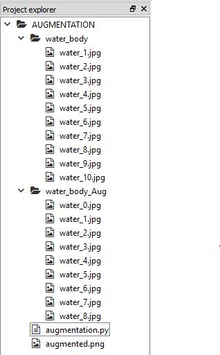
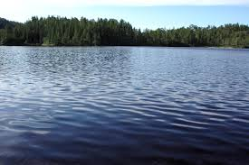
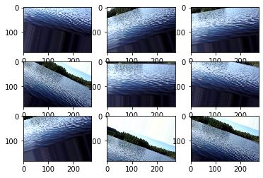

# Image-Augmentation
Python, Keras

## File Structure

## Augmented Result

-  Before

-  After

## Refrences

- [OpenCV](https://opencv.org)

- [Pyimagesearch](https://www.pyimagesearch.com)

- [Mathworks](https://in.mathworks.com)

- [Keras](https://keras.io/)

- [Scikit-Learn](https://scikit-learn.org)

